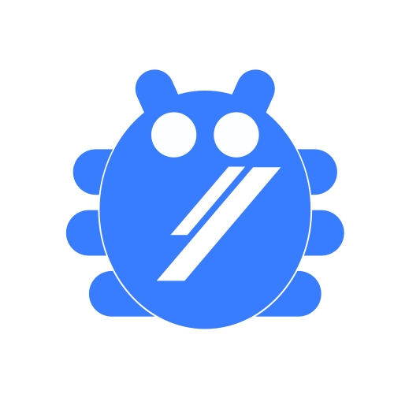

 
<h1 align="center">Bienvenido✅ a la comunidad Codefabs🔰</h1>
 
<h3 align="center" > ¡Aprende📙, y comparte con los demás!😎

</h3>

  

> [!IMPORTANT]
> Forma parte de nuestra comunidad para tener la oportunidad de aprender sobre **Desarrollo Web**💻 y **Diseño UX/UI**📲 totalmente **!gratis!** 💸💸
Aquí encontrarás cursos, consejos, guías para buenas prácticas de programación, tutoriales, y una gran variedad de contenido que te será de utilidad para iniciarte en el desarrollo web **Full-Stack** desde un enfoque universitario, es decir, todo lo que aprendas aquí será como si estudiaras en la universidad.💻

---
> [!NOTE]
> # Iconografía
> - ✅ :indica que el contenido está disponible actualmente
> - 🔄 :indica que el contenido recibe actualizaciones y revisiones periodicas
> - 🔜 :indica que el contenido está en desarrollo o planeación para su próxima integración

---

📑A continicaión se muestra la tabla de contenido donde encontrarás el material disponible hasta el momento(cursos, tutoriales, tips, etc). 

# Tabla de Contenido
1. [**Cursos**](#cursos)
   1. [Maquetación Web](https://codefabs.gitbook.io/maquetacion-web/) ✅ 🔄
   2. [Introducción al Frontend (pendiente)](#pendiente) 🔜
   3. [introducción al backend (pendiente)](#pendiente) 🔜
   

 

 
